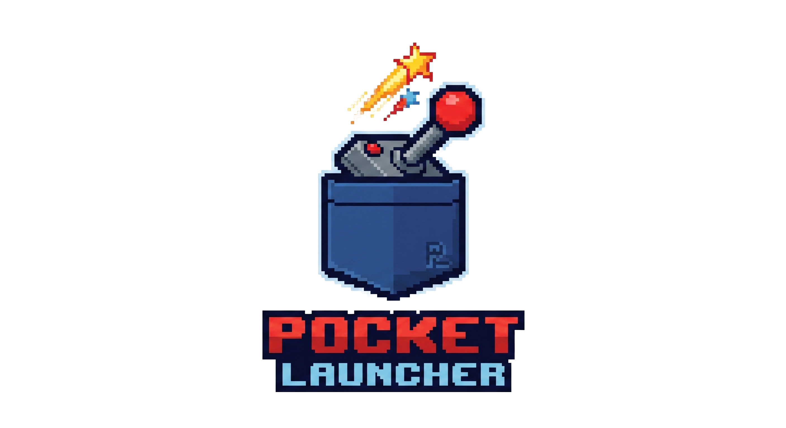

# 🎮 Pocket Launcher

A console-inspired Android frontend designed for gaming handhelds, emulation, and Android gaming.

---

## 📖 About Pocket Launcher

Pocket Launcher is an Android gaming frontend designed to transform Android handheld devices and tablets into a dedicated gaming console experience.

The goal is simple:

**Turn Android into a gaming operating system.**

Instead of navigating through Android menus, app drawers, and multiple emulator applications, Pocket Launcher provides a unified console-style interface where users can access:

- Retro games
- Android games
- Applications
- Emulators
- Gaming tools

all from one controller-friendly dashboard.

---

# 🎯 Project Vision

Current Android gaming frontends are extremely powerful, but Pocket Launcher aims to create a different experience.

The focus is:

🎮 Console-style navigation  
🎮 Controller-first design  
🎮 Touch-friendly interaction  
🎮 Simple library management  
🎮 Automatic emulator detection  
🎮 A polished handheld gaming experience  

Inspired by:

- Xbox 360 Dashboard
- Original Xbox One Dashboard
- Steam Big Picture Mode
- PlayStation Vita UI
- Nintendo Switch UI

Pocket Launcher aims to feel less like an Android application and more like a dedicated gaming console.

---

# ✨ Planned Features

## 🏠 Console Dashboard

A horizontal navigation system designed around controller input.

Main sections:

- Home
- Retro
- Android Games
- Applications
- Settings

Navigation will support:

✅ Touch input  
✅ Swipe gestures  
✅ Bluetooth controllers  
✅ Handheld gaming devices  

---

# 🎮 Retro Game Management

Pocket Launcher will scan and organise retro libraries by system.

Supported examples:

- Game Boy
- Game Boy Color
- Game Boy Advance
- NES
- SNES
- Nintendo 64
- Nintendo DS
- PlayStation
- PSP
- Dreamcast
- GameCube
- Arcade

Instead of mixing ROM files together, users can assign folders to specific systems.

Example:
/ROMs
├── GBA
├── PSP
├── PS1
├── SNES

Each system receives its own library.

---

# 🕹 Emulator Integration

Pocket Launcher aims to automatically detect installed emulators and provide simple configuration.

Examples:

| System | Emulator |
|---|---|
| PSP | PPSSPP |
| PlayStation | DuckStation |
| Nintendo DS | DraStic / melonDS |
| Retro Systems | RetroArch cores |

Future plans include:

- Emulator detection
- Per-system emulator assignment
- RetroArch core selection
- Automatic recommendations

---

# 📱 Android Game Library

Pocket Launcher also manages installed Android games.

Features:

- Detect installed games
- Display artwork
- Launch directly
- Track recently played titles

---

# 📦 Application Library

A dedicated application section for installed apps.

Useful for:

- Streaming apps
- Tools
- Emulators
- Gaming utilities

---

# 🕒 Recently Played System

The home dashboard will focus on recently used content.

Displayed:

- Last 5 played retro games
- Last 5 Android games
- Last 5 applications

The goal is:

"Start playing immediately."

---

# 🎨 Design Philosophy

Pocket Launcher uses a custom gaming-focused visual style.

Design goals:

- Dark theme
- Strong contrast
- Large tiles
- Smooth animations
- Console-style navigation
- Controller-friendly focus system

Colour inspiration:

🔴 Retro gaming red accents  
🔵 Deep console blues  
⚫ Dark backgrounds  

---

# 🛠 Current Development

Pocket Launcher is currently in early development.

Current progress:

✅ Android application foundation  
✅ Kotlin project setup  
✅ Basic launcher interface  
✅ App scanning  
✅ Android game detection  
✅ Retro ROM scanning foundation  
✅ Controller support foundation  
✅ Settings integration  
✅ Custom branding started  

Currently being developed:

🚧 Console dashboard redesign  
🚧 Emulator detection  
🚧 RetroArch core management  
🚧 Artwork system  
🚧 Improved navigation  
🚧 Full controller-first UI  

---

# 📸 Screenshots

Screenshots will be added as development progresses.

---

# 💻 Technology

Built with:

- Kotlin
- Android Studio
- Jetpack Compose
- Gradle

Target devices:

- Android handheld gaming devices
- Foldable devices
- Tablets
- Android TV style systems

---

# 🚀 Future Goals

Long term goals:

- Automatic setup wizard
- Metadata scraping
- Game artwork downloads
- Save management
- Cloud backup
- Multiple controller layouts
- Themes
- Plugin support
- Handheld manufacturer support

---

# 🤝 Contributions

Pocket Launcher is currently a personal development project.

Feedback, ideas and suggestions are welcome.

---

# 📜 License

License information will be added once the project reaches a stable release.

---

🎮 Pocket Launcher  
"Your Android device. Your games. One console experience."

